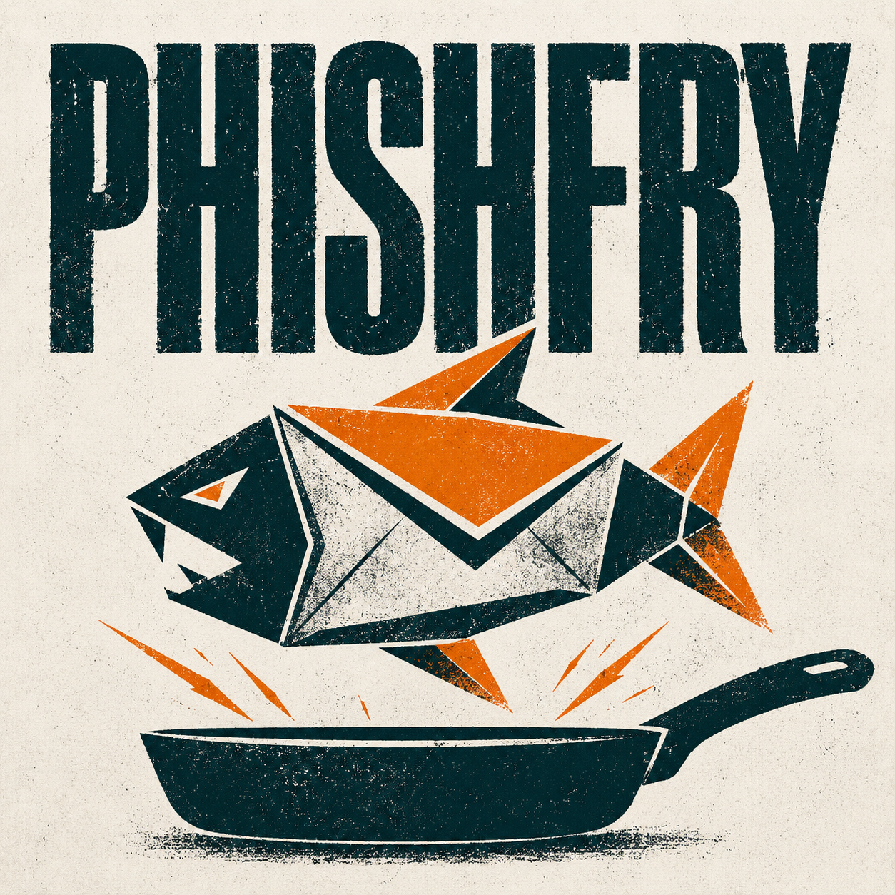
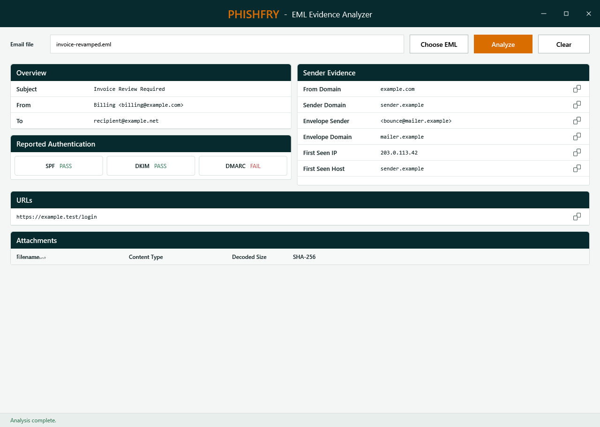

<p align="center">
  
</p>

<p align="center">
  Local EML evidence analysis for email security and forensic review.
</p>

---

PhishFry is a focused Windows PowerShell 5.1 utility for inspecting evidence contained in .eml files. It presents message headers, reported authentication results, sender evidence, URLs, and attachment hashes in a simple WPF interface.

The analysis stays on the local computer. The script does not contact external services, open URLs, or execute attachments.

> PhishFry can analyze any .eml file stored locally. Nothing is uploaded.

## Install

You need Windows PowerShell 5.1 on Windows. No additional modules are required.

```powershell
git clone https://github.com/delriscotechnologies/phishfry.git
cd phishfry
powershell.exe -File .\PhishFry.ps1
```

Choose an `.eml` file, select **Analyze**, and review the results. Files larger than 50 MB are rejected.

If your organization restricts PowerShell execution, follow its approved execution-policy and code-signing requirements.

## What it does

1. Reads the selected .eml file into memory and parses its headers and MIME structure.
2. Decodes supported Base64 and quoted-printable content.
3. Extracts URLs from text and HTML message parts.
4. Calculates SHA-256 hashes for attachments without writing them to disk.

## Output

| Section | Evidence shown |
|---|---|
| Overview | Subject, date, From, To, and Cc |
| Reported Authentication | SPF, DKIM, and DMARC results reported in the message headers |
| Sender Evidence | From and Sender domains, Return-Path, Reply-To, and the oldest `Received` host and IP |
| URLs | Unique HTTP and HTTPS URLs found in decoded text and HTML message parts |
| Attachments | Filename, content type, decoded size, and SHA-256 hash |

Copy buttons copy individual evidence values to the Windows clipboard.

## Demo



## Scope and limits

- Analysis is local and read-only; the selected .eml file is not modified.
- URLs and attachments are displayed as evidence but are never opened or executed.
- SPF, DKIM, and DMARC values are reported from existing email headers. PhishFry does not independently perform DNS lookups or cryptographic verification.
- Header values can be forged. Sender and routing fields are evidence for investigation, not proof of identity.
- A SHA-256 hash identifies attachment content; it does not determine whether the attachment is safe.
- PhishFry does not provide a phishing, malware, or reputation verdict.

See [SECURITY.md](SECURITY.md) for security and vulnerability-reporting guidance.

## License

PhishFry is available under the [MIT License](LICENSE).
